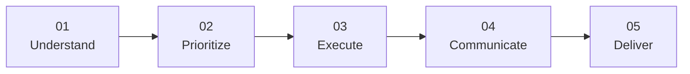

<!--
╔══════════════════════════════════════════════════════════════════════╗
║              ALEBIOSU OLUWADAMILARE SAMUEL                         ║
║              Virtual Assistant • Administrative Support             ║
║              Professional GitHub Portfolio                           ║
╚══════════════════════════════════════════════════════════════════════╝
-->

# **ALEBIOSU OLUWADAMILARE SAMUEL**

### `Virtual Assistant` • `Administrative Support` • `Remote Professional`

  <strong>Helping professionals and growing businesses stay organized, productive, and focused.</strong>

&nbsp;

&nbsp;

  

**Reliable support. Organized workflows. Clear communication. More time for what matters.**

---

##  PROFESSIONAL PROFILE

I am a **Virtual Assistant focused on administrative support, organization, research, communication, and day to day business assistance**.

I help founders, entrepreneurs, executives, professionals, and growing businesses manage the tasks that consume valuable time allowing them to focus on priorities, clients, and growth.

My approach is simple:

**Understand the task → Organize the workflow → Execute accurately → Communicate clearly → Deliver on time.**

---

##  AT A GLANCE

| **Client Experience** | **Tasks Completed** | **On-Time Delivery** | **Remote Availability** |
|:---:|:---:|:---:|:---:|
| **7+** | **50+** | **95%+** | **Worldwide** |

---

##  CORE SERVICES

<table>
<tr>
<td width="50%" valign="top">

###  Calendar & Scheduling

- Calendar management
- Meeting coordination
- Appointment scheduling
- Reminders and follow-ups
- Travel and itinerary planning
- Schedule organization

</td>

<td width="50%" valign="top">

###  Email & Inbox Management

- Inbox organization
- Email sorting and prioritization
- Professional correspondence
- Follow-up management
- Response drafting
- Important-message tracking

</td>
</tr>

<tr>
<td width="50%" valign="top">

###  Research & Data Support

- Web research
- Lead research
- Competitor research
- Data collection
- Data entry
- Spreadsheet management
- Research summaries

</td>

<td width="50%" valign="top">

###  Administrative Support

- Document preparation
- File organization
- Task tracking
- Digital organization
- SOP documentation
- Administrative coordination
- General virtual assistance

</td>
</tr>

<tr>
<td width="50%" valign="top">

###  Customer Support

- Customer enquiries
- Client communication
- Follow-ups
- Support coordination
- Information management
- Professional communication

</td>

<td width="50%" valign="top">

###  Social Media Assistance

- Content scheduling
- Caption drafting
- Engagement support
- Content organization
- Basic social media administration
- Publishing coordination

</td>
</tr>
</table>

---

##  WHAT I BRING TO THE TABLE

<table>
<tr>
<td align="center" width="25%">

### 
**Attention to Detail**

Accurate, careful, and quality-focused execution.

</td>

<td align="center" width="25%">

### 
**Proactive Support**

I look ahead, identify priorities, and keep tasks moving.

</td>

<td align="center" width="25%">

### 
**Organization**

Structured workflows that reduce clutter and missed tasks.

</td>

<td align="center" width="25%">

### 
**Reliability**

Consistent communication, follow-through, and professional delivery.

</td>
</tr>
</table>

---

##  TOOLS & PLATFORMS

---

##  PORTFOLIO & WORK SAMPLES

A selection of practical work demonstrating my ability to organize information, support business operations, conduct research, manage tasks, and communicate professionally.

> **More projects and work samples will be added as my portfolio grows.**

<table>
<tr>
<th>Project / Work Sample</th>
<th>Skills Demonstrated</th>
<th>Evidence</th>
</tr>

<tr>
<td><strong>Administrative Support</strong></td>
<td>Organization • Documentation • Task Management</td>
<td><a href="#">View Project</a></td>
</tr>

<tr>
<td><strong>Research & Data Management</strong></td>
<td>Web Research • Data Entry • Reporting</td>
<td><a href="#">View Project</a></td>
</tr>

<tr>
<td><strong>Calendar & Inbox Workflow</strong></td>
<td>Scheduling • Email Management • Prioritization</td>
<td><a href="#">View Project</a></td>
</tr>

<tr>
<td><strong>Digital Organization</strong></td>
<td>File Management • Documentation • Productivity</td>
<td><a href="#">View Project</a></td>
</tr>

</table>

 

>  **Portfolio evidence, screenshots, videos, and supporting documents can be added here as the portfolio develops.**

---

## 🔄 MY WORK PROCESS

| **Stage** | **What I Do** |
|:---:|---|
| **01 Understand** | Understand the task, objective, expectations, and desired outcome. |
| **02 Prioritize** | Organize tasks according to urgency, importance, and deadlines. |
| **03 Execute** | Complete the work carefully using appropriate tools and workflows. |
| **04 Communicate** | Provide clear updates and flag important issues when necessary. |
| **05 Deliver** | Deliver completed work in an organized and professional format. |

---

##  WHY WORK WITH ME?

### **Professional & Dependable**
I approach every task with professionalism, attention to detail, and respect for deadlines.

### **Organized & Structured**
I help turn scattered tasks and information into clear, manageable workflows.

### **Adaptable**
Every business has a different workflow. I can adapt to existing processes, tools, and communication preferences.

### **Focused on Outcomes**
The goal is not simply to complete tasks — it is to help make your workday more organized and productive.

### **Clear Communication**
You should always know what has been completed, what is in progress, and what requires attention.

---

##  REMOTE SUPPORT

**Available to support individuals, startups, entrepreneurs, and businesses worldwide.**

Whether you need **ongoing virtual assistance, administrative support, or help with a specific project**, I can provide flexible remote support based on your needs.

---

##  LET'S WORK TOGETHER

### **Have tasks that are taking time away from what matters?**

Let's turn those tasks into organized, completed work.

  

###  WhatsApp

**[+234 814 157 1631](https://wa.me/2348141571631)**

Quick enquiries and conversations.

###  Email

**[alebiosuva@gmail.com](mailto:alebiosuva@gmail.com)**

For professional enquiries and collaborations.

---

### *Organized work. Clear communication. Better results.*

**© Alebiosu Oluwadamilare Samuel**

